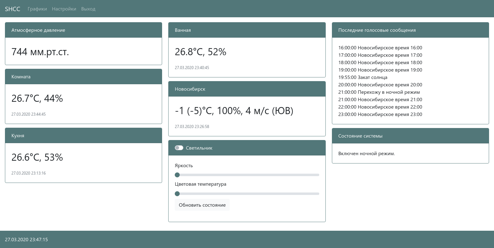
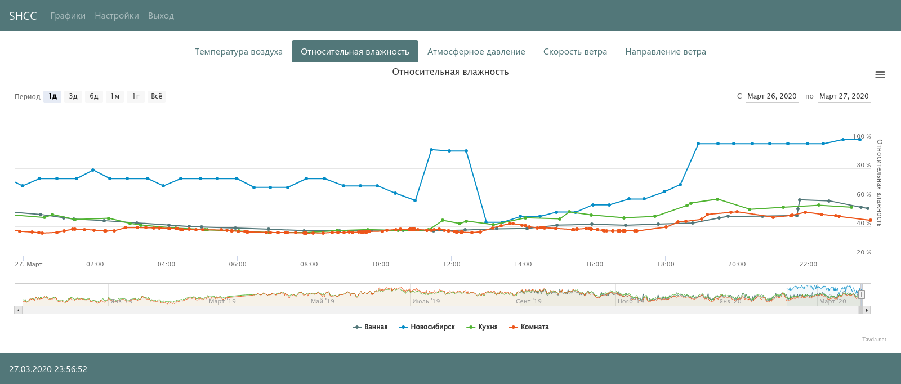
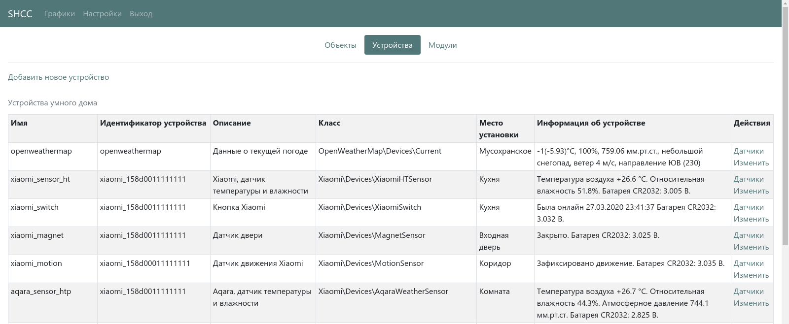

# Контроллер умного дома SHCC

SHCC - сокращение от SmartHome Control Center.

Проект написан на языке PHP с использованием сервера баз данных PostgreSQL и Redis. Для запуска могут быть использованы любые дистрибутивы Linux.

Цель проекта: создать PHP-фреймворк для создания контроллера умного дома с возможностью расширения функционала через установку дополнительных composer-пакетов.

Изначально, целью проекта было создание контроллера умного дома на языке PHP, но в ходе его реализации стало понятно, что использование composer позволит облегчить модификацию используемого кода и создавать плагины, которые расширят базовый функционал и легко добавлять поддержку оборудования. При этом минимальное использование ресурсов фреймворком сохраняется, что актуально для Raspberry Pi и аналогов. Кроме того, composer и стандарты PSR сделают код понятным и удобным для модификации.

Требования к версиям ПО были повышены в связи с выходом популярных дистрибутивов Ubuntu 22.04 LTS с долгосрочным временем поддержки и Fedora 36:

- PHP 8.1;
- PostgreSQL 14;
- Redis 6.0.

Проект использует систему инициализации systemd.

[Проект на Github](https://github.com/fsa/shcc).

[Документация в репозитории проекта](https://github.com/fsa/shcc/blob/main/docs/index.md).

[Документация в репозитории проекта версии в разработке](https://github.com/fsa/shcc/blob/devel/docs/index.md).

## Скриншоты

Внешний вид системы полностью зависит от того, кто её будет модифицировать. На скриншотах ниже приведены варианты, которые можно было реализовать на старых версиях системы. В новых версиях внешний вид системы зависит от вас, но используемые компоненты позволят ввм легко обеспечить подобный вид или использовать свой.

### Основной экран

### Отображение данных в виде графиков

### Отображение списка имеющегося и обнаруженного оборудования и управление им

